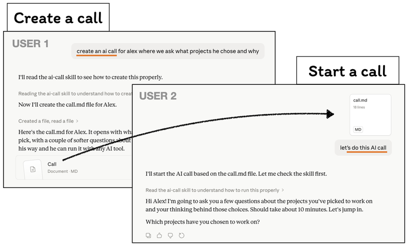

# AI Call

People have calls with each other to brainstorm, to interview, to get information. Now imagine having that same call — but with an AI.

An **AI call** is a conversation where an AI asks you questions one at a time, follows up on what you say, pushes you to think deeper, and produces a clean transcript when you're done. It's a brain dump with a guide.

## Why AI Calls?

We already talk to AI all the time — but chatting is passive. You type, it responds, you type again. An AI call flips that. The AI drives the conversation. It asks the questions. It follows up. It keeps you focused.

This matters because **not everyone thinks by writing.** Some people need to be asked. They need structure, they need prompts, they need someone (or something) pulling ideas out of them. AI has gotten good enough to do this — it asks great questions, picks up on what you said, and surfaces things you wouldn't have thought of on your own.

But personal brainstorming is just the beginning.

### Send an AI call to someone else

Imagine you want to ask a colleague a set of questions. Instead of scheduling a meeting, you craft an AI call — a set of topics and questions — and send it to them. They open it on their own time, run it with their preferred AI tool (voice or text), and send you back the transcript.

You've just had an async, structured conversation without both of you needing to be online at the same time.

### Put it on their calendar

Take it further: schedule the AI call as a calendar event. "Tuesday 3pm — answer these questions about the Q2 roadmap." The person shows up, talks to the AI for 15 minutes, and you get a clean report.

### Let the AI schedule it

Now imagine an AI agent is building something for you — say, a website. It hits a point where it needs answers only a human can give. If it has access to your calendar, it books time: "I need 10 minutes of your focused input on these questions." The AI becomes proactive about getting human input, instead of just blocking and waiting.

This is the key insight: **an AI call is tool execution where we prompt a human.** It inverts the usual model. Instead of humans prompting AI, the AI prompts the human — in a structured, time-bounded, respectful way.

### Transcripts as building blocks

The output of an AI call is a markdown transcript. That transcript becomes context for the next step. Send AI calls to five team members, collect the transcripts, and ask an AI to synthesize the common themes. Turn them into documentation, summaries, reports. The transcript is a portable artifact that flows naturally into any AI workflow.

### Open by design

AI Call is an idea, not a product. Anyone can implement it for any AI tool — it's just a structured prompt. Your data stays on your machine. There will be an explosion of AI call software. This repo is one early, open-source implementation.

---

## How to Use

<p align="center">
  
</p>

## This Implementation

1. You provide a **prompt** — a topic, questions, or a job description
2. The AI asks questions **one at a time**, waiting for your response
3. It follows up if your answer is incomplete or opens an interesting thread
4. When done, it generates a clean markdown transcript with all Q&A pairs

**No API keys needed** — uses whatever model your agent is already running.

Works with any agent that supports the [Agent Skills standard](https://agentskills.io): **pi**, **Claude Code**, **OpenAI Codex**, and others.

## Install

### Pi

```bash
# From npm
pi install npm:ai-call

# From git
pi install https://github.com/nicola/ai-call

# Pin a version
pi install npm:ai-call@1.0.0
pi install https://github.com/nicola/ai-call@v1.0.0
```

### Claude Code

```bash
# Global (available in all projects)
git clone https://github.com/nicola/ai-call ~/.claude/skills/ai-call

# Or project-level
git clone https://github.com/nicola/ai-call .claude/skills/ai-call
```

### OpenAI Codex

```bash
# Global
git clone https://github.com/nicola/ai-call ~/.agents/skills/ai-call

# Or project-level
git clone https://github.com/nicola/ai-call .agents/skills/ai-call
```

### Manual

Copy `SKILL.md` into your agent's skills directory. That's the only file that matters.

## Usage

Once installed, just ask your agent:

- *"Start an AI call about my experience with distributed systems"*
- *"Interview me about my leadership style"*
- *"Ask me questions about this job description: [paste JD]"*
- *"Run an AI call — ask about my top 3 projects and what I learned"*

The agent will ask questions one at a time, follow up naturally, and save a transcript as `YYYY-MM-DD - [Topic].md`.

## Examples

**Topic-based:**
> "Start an AI call about my experience building mobile apps"

**Question list:**
> "Ask: 1) What's your biggest technical challenge? 2) How do you handle disagreements? 3) What are you learning right now?"

**Job description:**
> "Interview me for this role: [paste job description]"

**Deep dive:**
> "Ask about my distributed systems experience. Deep dive on consistency models and failure handling. Cover 3-4 real projects."

## How It Works

This is a pure-prompt skill — no scripts, no dependencies, no API keys. The `SKILL.md` file contains instructions that tell the agent how to behave as an interviewer. Your agent loads these instructions when it detects a matching request.

The transcript is saved locally as a markdown file. Your data never leaves your machine (beyond whatever your agent's model provider already sees).
